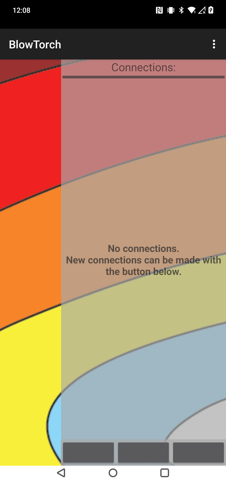
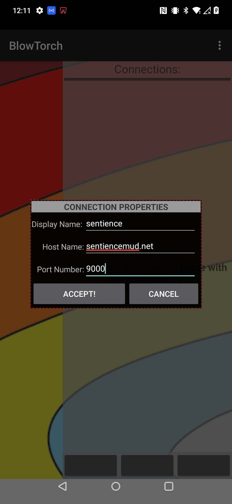
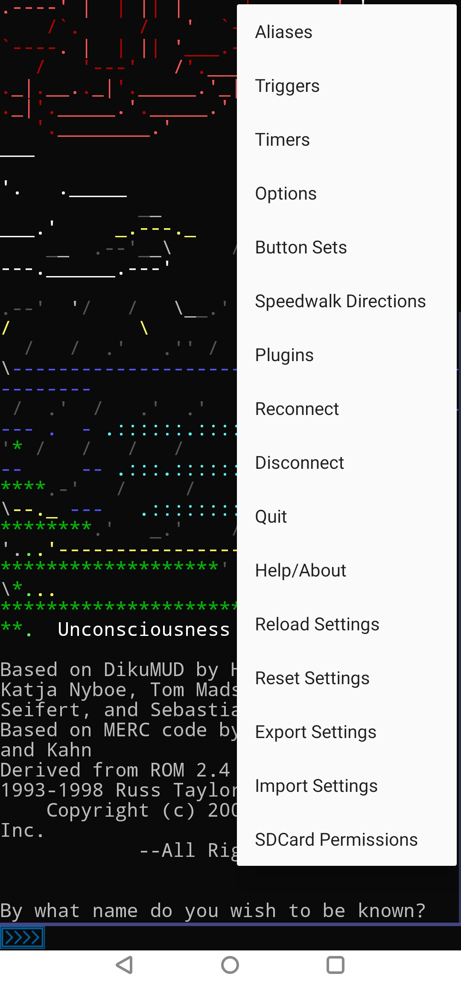
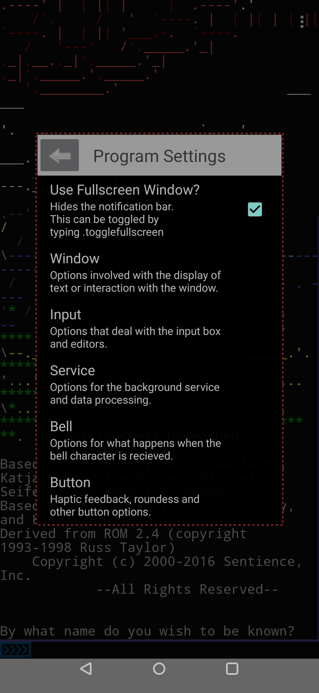
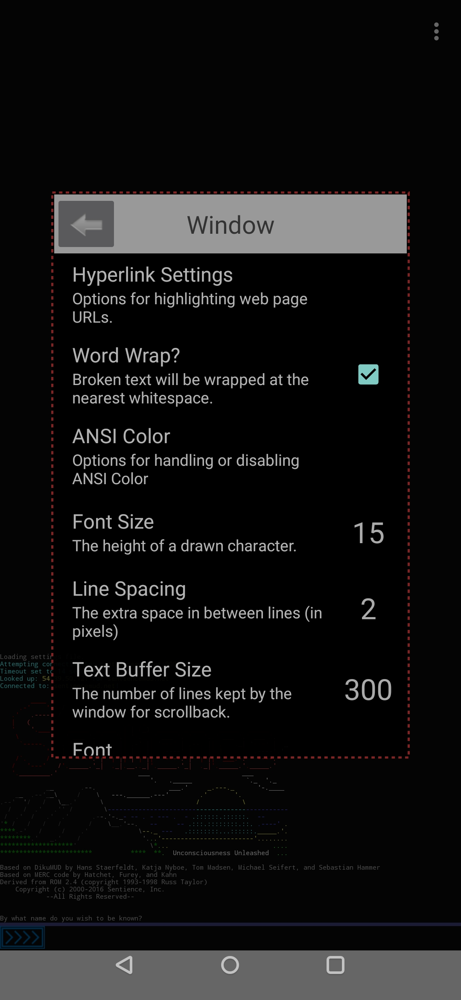
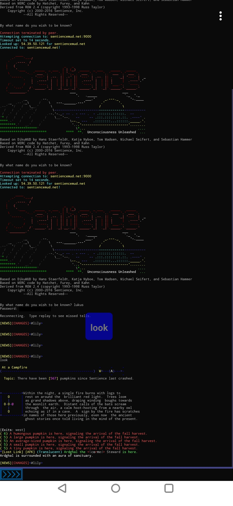
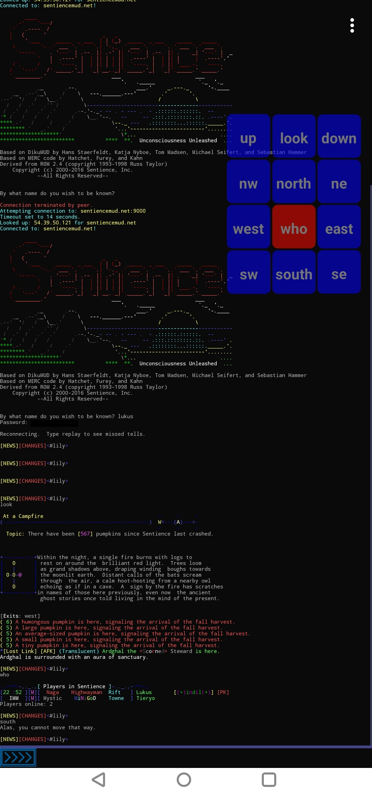

# Downloading: 
Look for [BlowTorch MUD Client](https://play.google.com/store/apps/details?id=com.happygoatstudios.bt) on the Google Play store.

# Basic Setup:

Above: the base Blowtorch interface. On my devices, the three buttons were all greyed out. The leftmost is 'New,' the middle is 'Help,' and the one on the right is 'Donate.'

Clicking on 'New' will bring up a screen to add connection properties. These have been populated with our connection details.

By default, the text is very large. You can click on the three dots in the upper right to access the menu, then 'settings'.

In the settings screen, scroll down to 'Window'.

The default font size is ridiculous. I usually turn it down to ~15.

An example of logging in, with a stray 'button' in the middle of the screen. We'll handle those on the '[buttons](BlowToch Button Configuration)' page.

An example of the connection after configuring buttons using the settings on the buttons page.