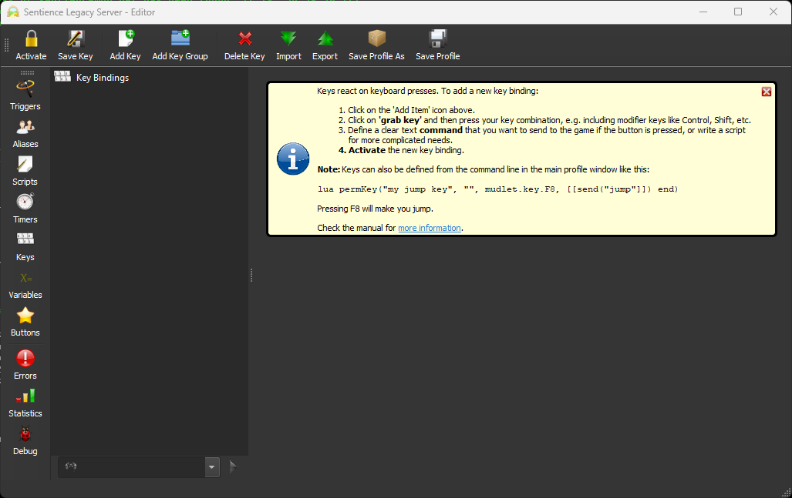

# Important Note about Number Pads
---
Mudlet does not use your number pad for navigation, like some other mud clients. To enable this, we have provided an [xml file](assets/numpad.xml) that will add the number pad keybindings typical of MUSHclient to your Sentience profile. You will need to click on 'Keybindings' in the Mudlet interface to access these settings.

On the keybindings page, you will need to click 'Import', then select the saved numpad.xml file from above.

Once the import is complete, your keybinding settings should look like this. Feel free to adjust any of these to suit your tastes.