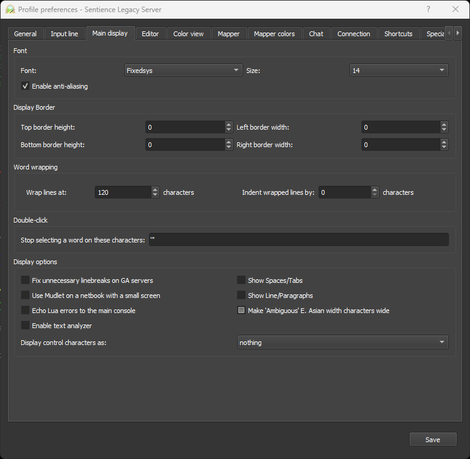

The basic mudlet interface is a bit more readable than mushclient. To create a new connection, you will need to press 'connect'.

Once you hit connect, you'll see a number of pre-populated muds. We're not interested in those, though! Hit the 'new' button, which will bring up the pane on the right. Fill out the connection details as shown and that is technically all you need to connect. In the future, you will need to click connect, then double click the profile you have made for Sentience to connect.

If you wish to set a character to automatically log in, set mudlet to automatically start this profile on launch, or to automatically reconnect to the game, you can set these on the 'options' tab of the connect window.

If you've set the connection details correctly, you should be presented with this screen.

Mudlet has a *lot* of settings available. For the purposes of this guide, we're only interested in the display settings tab.

On the display settings page, you can set the font you wish to use, as well as font size. I personally prefer FixedSys as I used to use MUSHclient. Additionally, under Word Wrapping, we advise changing this from the default of 80 to 120 or greater.

# A word about keybindings
---
Mudlet does not, by default, use the number pad on your computer to aid in navigation like MUSHclient. To enable this, please see the [keybindings](mudlet-keybindings) page.