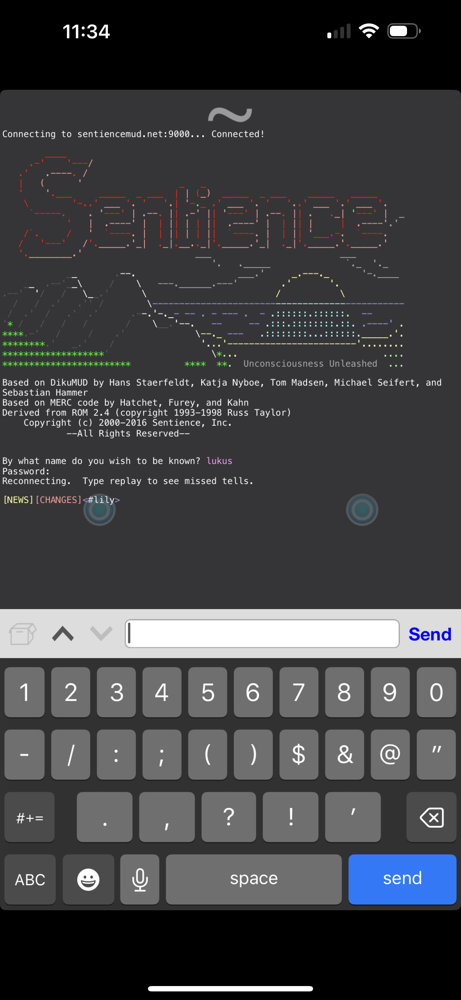

# Connecting
---

In the upper left of the MUDRammer screen, you will need to click the gear icon to access the application settings. From here, you can go to Worlds, then click the + sign to begin adding a connection to Sentience.

The connection details here are largely the same as on other clients. You can additionally enter a nickname for the game, and commands to send on connection.

The font size is ridiculous! Settings -> Themes will allow you to change font, font size, and colour scheme. I recommend 8pt here.

Once you've saved the details, you can connect to Sentience at any time from the 'Worlds' menu. This is what you should see on login. Note the 'Server Status' at the top, as this will display any MSSP data currently being sent by the game.

Once you're logged in, note the two blue dots. These are radial controls. You can adjust the settings for the left one under Settings -> Radial Control. While the left is fully customizable, the right appears to be reserved for movement.

The right dot is for movement, by tapping and holding, then moving your finger, you can select directions to move.

On the 'Worlds' menu, tapping the blue 'i' button for Sentience will bring up world settings that allow further customization, such as triggers, aliases, and timers.