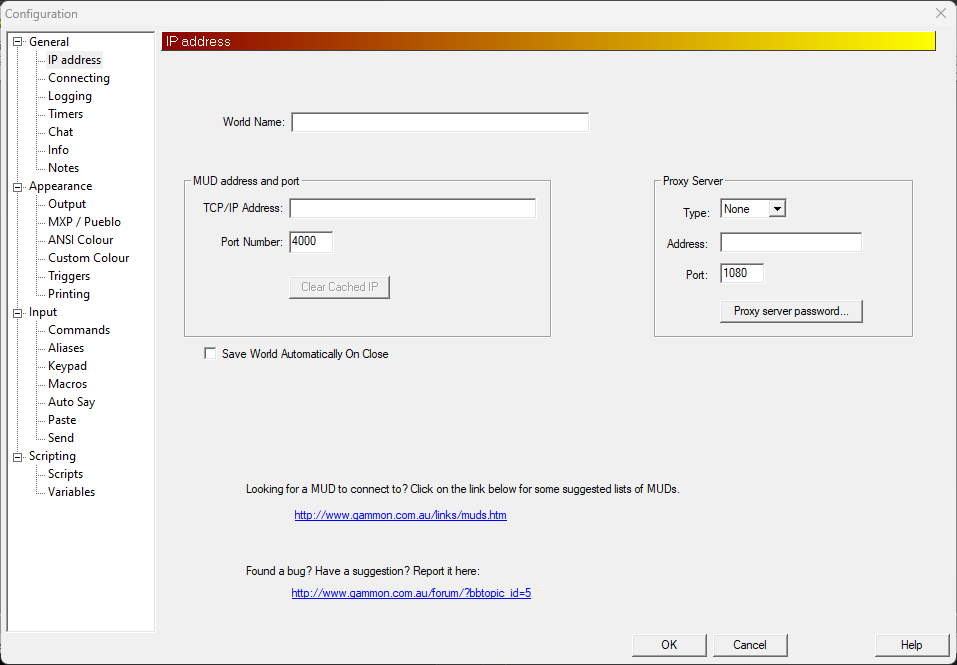
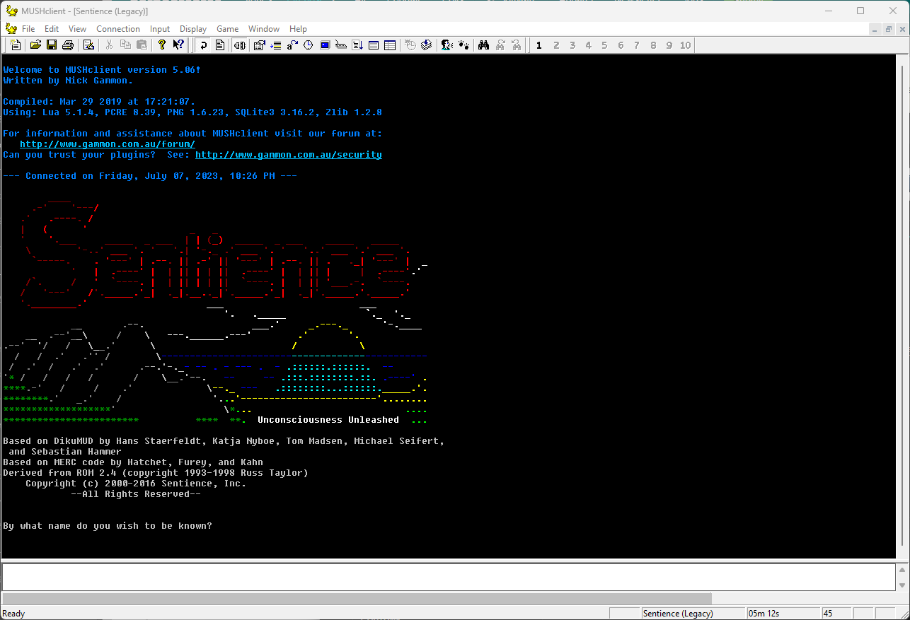

Downloading: [http://www.gammon.com.au/downloads/dlmushclient.htm](MCDownloadLink)

Basic configuration:

Above: The base MUSHclient interface. By default, the 'activity' bar is not docked at the top of the screen. I recommend docking it to the right of the other buttons in the toolbar.

Connection details are required before you can proceed with modifying any other settings. For Sentience, they are as follows:
TCP/IP Address: sentiencemud.net
Port Number: 4000
You may also wish to check the `Save World Automatically on Close` box. If you need to use a proxy to escape your local network, this can be set under Proxy Server.

Additional connection options - On the 'Connecting' config section, you can specify a username and password to automatically log in. Please be aware that you will need to select "Diku-Style" from the Connect dropdown.

Appearance -> Output allows you to adjust some of the display options, such as font size, playing sounds on new activity, or changing the number of columns allowed per line. We recommend adjusting this from the default of 80 up to 120 or 160.

Once you've entered the connection details, if you haven't set up auto login, you should be presented with the game's splash screen. Now would be a good time to click the 'Save' icon in the upper left to save your world details.