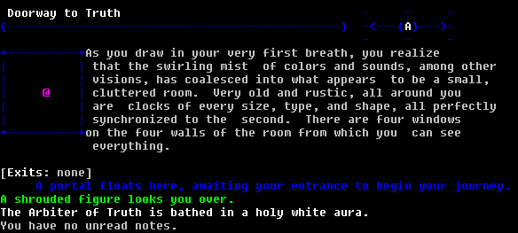
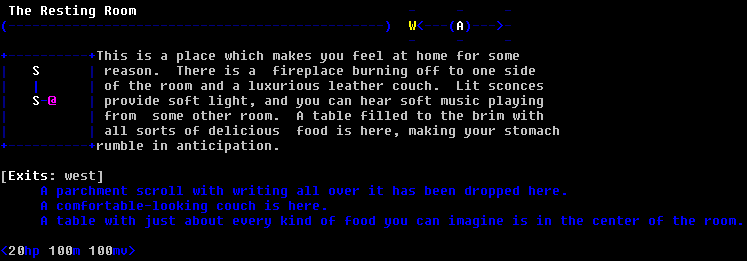

# Getting Started
When you first connect to [SentienceMUD](telnet://sentiencemud.net:9000), you will be greeted with our splash screen and a prompt to provide a character name. If you already have a character, provide the password and you should be in! 

{: .info}
If you need help resetting your password, please reach out to Tieryo on our [Discord server](https://discord.gg/E2Ahw5Xy), or Ryan Hanson on facebook, or as a last resort, [email tieryo@sentiencemud.net](mailto:tieryo@sentiencemud.net).

If you are new to the game, or returning and wish to create a new character for a fresh start, read on:

The first thing you will need to do is confirm you want to start a new character with your chosen name, set a password, and provide your email address. While email is not currently used by any ingame system, it will help with making password resets easier.

---

# Character Creation
Once you've provided an email address, you will be asked to make a number of selections that will impact your future in the world of Sentience.

1. Enable colour?
   This is highly recommended on the Legacy server. Colour is heavily used for showing clues.
2. Choose your alignment - Good, Neutral, Evil

   {: .warning}
   While not noted at this point in character creation, this impacts your available races and subclasses. You may only select races that match your chosen alignment, while you are given a degree of freedom with subclasses.
   Neutral characters can choose any subclass, while Good and Evil are limited to Neutral and their own alignment. No Vampire Paladins, sorry.

3. Choose your [race](races) - Limited by alignment. For a summary of all races, see [races](races). In the game, you can type `help` for a list of all races and their maximum stats.
4. Choose your sex. On the Legacy server, this is Male or Female.
5. Choose your starting [class](classes) - You will need to choose a class, which, in combination with your alignment, will determine your available starting subclasses. `help <class>` will give information about each class.
6. Choose your starting subclass - Determined by alignment and class. `help <subclass>` will give a basic summary of the subclass, along with its available skills and fighting style.
7. Once you have selected your subclass, you're sent into the game!

---

# First Steps
From here, you will be in the game world. If you are new or rusty with regards to muds, you may want to review Sentience's [common conventions](common-conventions) for some basic information about interacting with the world. If you need help at any time, you can use `helper <message>` to reach out to any online helpers or staff.

The command `commands` will give you a large, unsorted list of verbs you can use to interact with the world. For many of these, you can use `help <verb>`, or if more than one result is returned, `help #<help index number>` will give you a specific help file.

A few things to note about rooms in Sentience:
- By default, the minimap is toggled on. If there are rooms connected to the one you are in, they will be shown to the left of the room description.
- In the top right is a compass. It will also show available exits from your current location. You can use this to help navigate.
- Below the description is a list of exit keywords from your current room.
- Visible objects in the room are indented below the Exits line.
- NPCs and players in the room are listed after objects, without indentation. They may also have auras of various colours on the lines following their descriptions.

{: .info}
If the 'Arbiter of Truth' does not automatically move you to the next room, you may do so by typing `enter portal`.

In this room you will see that the map is different. The white 'S' indicators to the left of your current position indicate 'safe' rooms. Additionally, the compass indicates that you can move west. If you would like some practice interacting with objects, you can use commands such as `look scroll` or `sit couch` (though you will need to `stand` before moving west). The scroll will have some information about movement, but you can always simply type the direction you would like to move if it is an available exit.

# R&R
If your vital stats ever get low, you should take the opportunity to either `rest` or `sleep`. Sleeping will recover more stats every tick, but if you are a PK player, or in a PK room, be aware that assassins can attempt to slit your throat. It is advised that you try to find a bedroll at some point, as these bedrolls will recover your stats more quickly.