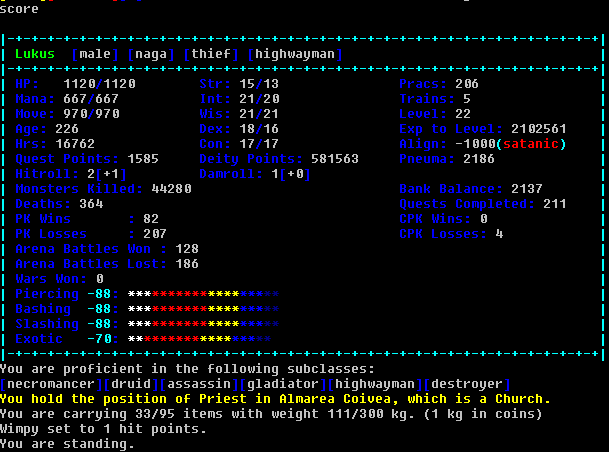

# Basic Information
---
There are a number of commands to get information about your character. The most common you will work with is the `score` screen:

This will give a large amount of information about your character. At the top you will see your name (and title, if applicable), as well as your current sex, race, class, and subclass.
Below this are three columns. The first has vital statistics, such as HP, mana, and movement, along with hours, quest points, and some pk statistics. The second column contains your attributes, which can be raised up to your race's cap with 'train' points.
The third column begins with your practices, trains, current level in your class, experience to next level, and alignment. There is a lot of information across these columns that will be important to your play.

At the bottom of the cyan box is your current armour class. Lower is better!
Below the box, you can see your former classes, your rank in your church (if any), how much you are carrying, what your 'wimpy' is set to (automatic fleeing), and your current position.

# Stats overview
---
**Strength** - Primarily used to determine bonuses to hit and damage rolls, maximum carrying capacity and weight, and the maximum weight of weapons you can wield.
{: .lh-thin}

**Intelligence** - Primarily used to determine the percentage gained when improving skills and spells.
{: .lh-thin}

**Wisdom** - Primarily used to determine how many practices you gain each time you level.
{: .lh-thin}

**Dexterity** - Primarily used for checking defensive skills and actions.
{: .lh-thin}

**Constitution** - Primarily used to determine hit point gain on level, and resistance to stuns or other shocks.
{: .lh-thin}

# Growing Up
---
At any time, you can type `skills` or `spells` to see your currently available skills and spells. In the case of skills, this shows their name and your current rating, from 1% to Master. For spells, you will also see a mana cost. If you are looking to only display specific skills or spells, you can append the name to the skills/spells command, such as `skill sword`.

To increase your skills, you will need to seek out trainers, such as Adamah in Plith, or Geofels in Olaria. When visiting these NPCs, you can type `practice <skill or spell>` to increase your rating. How much this increases depends on both the difficulty of the skill and your intelligence attribute.

To train attributes, you need trains. At the same NPCs where you would practice skills, you can `train <stat>`, or simply `train` to see available statistics. You can raise your core attributes, as well as your hp, mana, and movement here.